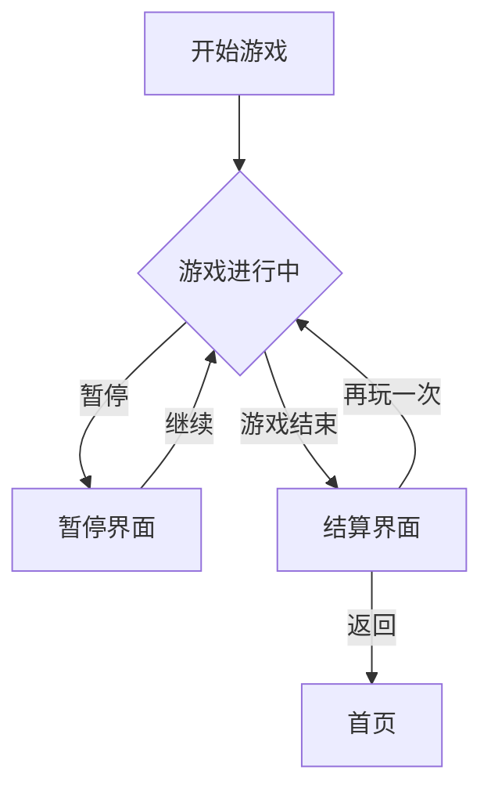

# 摸鱼小游戏集合 - 产品需求文档

## 1. 产品概述

一个集合了多款精品网页小游戏的摸鱼游戏平台，专为职场人士在工作间隙放松解压设计。平台包含5款精心挑选的经典小游戏，操作简单、上手快、无需长时间投入，让用户能够快速获得成就感与乐趣。

- **核心价值**：提供即开即玩、无需注册、随时暂停的轻量级游戏体验
- **目标用户**：需要工作间隙放松的职场人士、学生群体
- **市场定位**：打造中国风+现代感的精品摸鱼游戏平台

## 2. 核心功能

### 2.1 游戏列表

1. **2048 - 数字融合**
   - 经典滑动合成游戏，通过移动方块使相同数字相加
   - 支持键盘方向键和触摸滑动

2. **俄罗斯方块 - 经典版**
   - 完美复刻童年回忆，支持方向键控制
   - 自动加速机制增加紧张感

3. **贪吃蛇 - 现代版**
   - 触控/键盘双支持，流畅操作体验
   - 精美渐变色蛇身设计

4. **弹跳球 - 益智挑战**
   - 控制球拍反弹球，打碎所有砖块
   - 多关卡设计，难度递进

5. **2048 升级版 - 融合挑战**
   - 融合俄罗斯方块下落机制与2048合成玩法
   - 双重乐趣，全新体验

### 2.2 页面结构

| 页面名称 | 模块名称 | 功能描述 |
|---------|---------|----------|
| 首页 | 游戏展示区 | 5款游戏卡片展示，悬停动效 |
| 游戏页 | 游戏画布 | 独立游戏界面，计分板，控制说明 |
| 结算页 | 得分展示 | 展示最终得分，最佳记录，分享按钮 |

## 3. 核心流程

### 3.1 用户使用流程

```
用户访问首页 → 选择游戏 → 进入游戏 → 游玩 → 结束 → 查看得分 → 返回首页
```

### 3.2 游戏交互流程图



## 4. 用户界面设计

### 4.1 设计风格

- **主题定位**：赛博朋克霓虹风格 × 中国传统元素
- **配色方案**：
  - 主色：深邃紫 #1a1a2e
  - 强调色：霓虹粉 #ff2e63, 霓虹蓝 #08d9d6
  - 辅助色：暗金色 #eaeaea
- **按钮风格**：霓虹发光边框，圆角设计，悬停时产生光晕效果
- **字体选择**：
  - 标题：ZCOOL XiaoWei (站酷小薇)
  - 正文：Noto Sans SC (思源黑体)
- **布局风格**：卡片网格布局，居中展示，大留白呼吸感
- **图标风格**：简约线性图标，带微妙动画

### 4.2 页面设计详述

#### 首页设计
- 全屏渐变背景，带动态粒子效果
- 中央标题带霓虹闪烁动画
- 5款游戏以卡片形式呈现，3D悬浮效果
- 卡片悬停时放大+发光，底部显示简短描述

#### 游戏页设计
- 深色游戏画布区，带网格线背景
- 顶部显示当前得分和最佳记录
- 游戏控制说明悬浮在角落
- 暂停/继续/返回按钮固定在右上角

#### 结算页设计
- 粒子庆祝动效
- 得分数字大字体展示，带跳动动画
- "再玩一次" 和 "返回" 双按钮选项

### 4.3 响应式设计

- **桌面优先**：1200px 基准设计
- **平板适配**：768px - 1199px，卡片两列排列
- **移动适配**：<768px，卡片单列，全屏游戏体验

## 5. 游戏详细规格

### 5.1 2048

| 属性 | 规格 |
|------|------|
| 画布大小 | 400x400px |
| 方块大小 | 100x100px |
| 初始数字 | 两个 2 |
| 合成规则 | 相同数字相加 |
| 计分规则 | 每次合成得分=合成数字值 |
| 结束条件 | 无法移动 |

### 5.2 俄罗斯方块

| 属性 | 规格 |
|------|------|
| 画布大小 | 300x600px |
| 方块单元 | 30x30px |
| 初始速度 | 1格/秒 |
| 加速规则 | 每10行+10%速度 |
| 计分规则 | 单行100分，连续消行加倍 |
| 结束条件 | 方块堆到顶部 |

### 5.3 贪吃蛇

| 属性 | 规格 |
|------|------|
| 画布大小 | 400x400px |
| 网格大小 | 20x20格 |
| 移动速度 | 150ms/格 |
| 加速规则 | 每吃5个食物+10速度 |
| 计分规则 | 每个食物10分 |
| 结束条件 | 撞墙或撞自身 |

### 5.4 弹跳球

| 属性 | 规格 |
|------|------|
| 画布大小 | 480x640px |
| 球拍宽度 | 100px |
| 球拍高度 | 15px |
| 球半径 | 10px |
| 砖块布局 | 8列x5行 |
| 计分规则 | 每块砖10分 |
| 关卡规则 | 清空所有砖块进入下一关 |

### 5.5 2048融合版

| 属性 | 规格 |
|------|------|
| 画布大小 | 400x500px |
| 方块大小 | 100x100px |
| 下落机制 | 每3秒下落一行 |
| 合成规则 | 相同数字融合 |
| 特殊方块 | 每20秒随机出现特殊方块 |

## 6. 技术规格

### 6.1 性能要求

- 首屏加载时间 < 2秒
- 游戏帧率稳定 60fps
- 内存占用 < 50MB

### 6.2 浏览器兼容

- Chrome 90+
- Firefox 88+
- Safari 14+
- Edge 90+

### 6.3 无障碍支持

- 键盘完全可操作
- 高对比度模式兼容
- 屏幕阅读器友好提示
