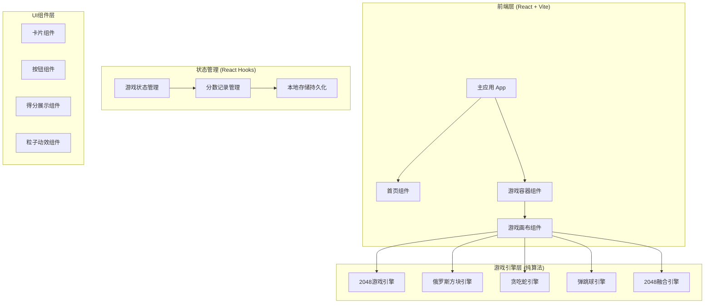
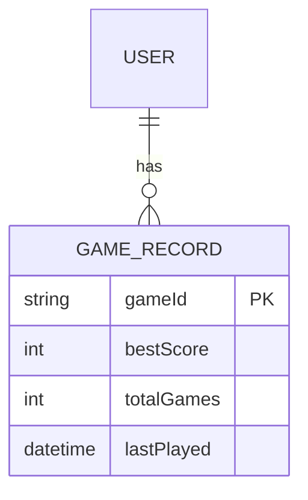

# 摸鱼小游戏集合 - 技术架构文档

## 1. 架构设计

### 1.1 系统架构图



### 1.2 目录结构

```
mouyu-games/
├── index.html
├── package.json
├── vite.config.js
├── src/
│   ├── main.jsx                 # 应用入口
│   ├── App.jsx                  # 主应用组件
│   ├── index.css                # 全局样式
│   ├── components/
│   │   ├── Home/
│   │   │   ├── Home.jsx         # 首页组件
│   │   │   ├── GameCard.jsx     # 游戏卡片组件
│   │   │   └── ParticleBg.jsx   # 粒子背景组件
│   │   ├── Game/
│   │   │   ├── GameContainer.jsx # 游戏容器
│   │   │   ├── GameCanvas.jsx    # 游戏画布
│   │   │   ├── ScoreBoard.jsx    # 得分板
│   │   │   └── GameOver.jsx      # 游戏结束弹窗
│   │   └── Common/
│   │       ├── Button.jsx        # 通用按钮
│   │       └── Title.jsx         # 标题组件
│   ├── games/
│   │   ├── Game2048/
│   │   │   ├── Game2048.jsx      # 2048游戏主组件
│   │   │   └── engine.js         # 2048游戏引擎
│   │   ├── Tetris/
│   │   │   ├── Tetris.jsx        # 俄罗斯方块主组件
│   │   │   └── engine.js         # 俄罗斯方块引擎
│   │   ├── Snake/
│   │   │   ├── Snake.jsx         # 贪吃蛇主组件
│   │   │   └── engine.js         # 贪吃蛇引擎
│   │   ├── Bounce/
│   │   │   ├── Bounce.jsx        # 弹跳球主组件
│   │   │   └── engine.js         # 弹跳球引擎
│   │   └── Fusion2048/
│   │       ├── Fusion2048.jsx    # 2048融合版主组件
│   │       └── engine.js         # 融合版引擎
│   ├── hooks/
│   │   ├── useGameLoop.js        # 游戏循环Hook
│   │   ├── useLocalStorage.js    # 本地存储Hook
│   │   └── useKeyboard.js        # 键盘控制Hook
│   └── utils/
│       ├── constants.js           # 常量定义
│       └── helpers.js             # 工具函数
```

## 2. 技术栈描述

### 2.1 前端技术选型

| 技术 | 版本 | 用途 |
|------|------|------|
| React | 18.x | UI框架 |
| Vite | 5.x | 构建工具 |
| TailwindCSS | 3.x | 原子化CSS |
| Framer Motion | 11.x | 动画库 |

### 2.2 项目初始化

```bash
# 使用 Vite 创建 React 项目
npm create vite@latest mouyu-games -- --template react

# 安装依赖
cd mouyu-games
npm install

# 安装动画库
npm install framer-motion

# 安装 TailwindCSS
npm install -D tailwindcss postcss autoprefixer
npx tailwindcss init -p
```

### 2.3 核心依赖

```json
{
  "dependencies": {
    "react": "^18.2.0",
    "react-dom": "^18.2.0",
    "framer-motion": "^11.0.0"
  },
  "devDependencies": {
    "@vitejs/plugin-react": "^4.2.0",
    "vite": "^5.0.0",
    "tailwindcss": "^3.4.0",
    "postcss": "^8.4.0",
    "autoprefixer": "^10.4.0"
  }
}
```

## 3. 路由定义

### 3.1 路由结构

由于项目规模较小，采用客户端路由实现：

| 路由 | 组件 | 描述 |
|------|------|------|
| / | Home | 首页，展示所有游戏 |
| /game/:id | GameContainer | 游戏页面，根据id加载对应游戏 |

### 3.2 路由实现

```jsx
// App.jsx
import { BrowserRouter, Routes, Route, useParams } from 'react-router-dom';
import Home from './components/Home/Home';
import GameContainer from './components/Game/GameContainer';

function GameRouter() {
  const { id } = useParams();
  return <GameContainer gameId={id} />;
}

function App() {
  return (
    <BrowserRouter>
      <Routes>
        <Route path="/" element={<Home />} />
        <Route path="/game/:id" element={<GameRouter />} />
      </Routes>
    </BrowserRouter>
  );
}
```

## 4. 游戏组件接口

### 4.1 游戏组件 Props 定义

```typescript
// 所有游戏组件的公共接口
interface GameProps {
  onScoreUpdate: (score: number) => void;
  onGameOver: (finalScore: number) => void;
  onExit: () => void;
}

// 游戏列表定义
interface GameInfo {
  id: string;
  name: string;
  description: string;
  icon: string;
  component: React.ComponentType<GameProps>;
}
```

### 4.2 2048 游戏引擎接口

```typescript
// engine.js
interface Game2048Engine {
  grid: number[][];           // 4x4 数字网格
  score: number;              // 当前分数
  bestScore: number;          // 最佳分数
  isGameOver: boolean;        // 游戏是否结束
  isWon: boolean;             // 是否达到2048

  init(): void;               // 初始化游戏
  move(direction: 'up' | 'down' | 'left' | 'right'): boolean;  // 移动操作
  addRandomTile(): void;      // 添加随机方块
  checkGameOver(): boolean;   // 检查游戏结束
  reset(): void;              // 重置游戏
}
```

### 4.3 俄罗斯方块引擎接口

```typescript
// engine.js
interface TetrisEngine {
  board: number[][];          // 游戏板 10x20
  currentPiece: Piece;        // 当前方块
  score: number;              // 当前分数
  level: number;              // 当前等级
  lines: number;               // 已消除行数
  isGameOver: boolean;         // 游戏是否结束
  isPaused: boolean;           // 是否暂停

  init(): void;               // 初始化
  move(direction: 'left' | 'right' | 'down'): boolean;
  rotate(): boolean;          // 旋转
  hardDrop(): void;           // 立即下落
  tick(): boolean;            // 游戏帧更新
  pause(): void;              // 暂停
  resume(): void;             // 继续
}
```

### 4.4 贪吃蛇引擎接口

```typescript
// engine.js
interface SnakeEngine {
  snake: Position[];           // 蛇身坐标数组
  food: Position;              // 食物位置
  direction: Direction;        // 移动方向
  score: number;               // 当前分数
  isGameOver: boolean;         // 游戏是否结束
  speed: number;               // 当前速度(ms)

  init(): void;               // 初始化
  setDirection(dir: Direction): void;  // 设置方向
  tick(): boolean;             // 游戏帧更新
  checkCollision(): boolean;   // 碰撞检测
  generateFood(): void;        // 生成新食物
}
```

## 5. Hooks 定义

### 5.1 游戏循环 Hook

```typescript
// hooks/useGameLoop.js
interface UseGameLoopOptions {
  callback: () => void;
  delay: number;
  enabled: boolean;
}

function useGameLoop({ callback, delay, enabled }: UseGameLoopOptions): void {
  // 使用 useEffect 和 setInterval 实现游戏循环
  // 支持动态调整延迟(加速/减速)
  // enabled 控制暂停/继续
}
```

### 5.2 键盘控制 Hook

```typescript
// hooks/useKeyboard.js
interface UseKeyboardOptions {
  onArrowUp?: () => void;
  onArrowDown?: () => void;
  onArrowLeft?: () => void;
  onArrowRight?: () => void;
  onSpace?: () => void;
  onEscape?: () => void;
  enabled?: boolean;
}

function useKeyboard(options: UseKeyboardOptions): void {
  // 监听键盘事件
  // 支持游戏常用按键
  // enabled 控制启用/禁用
}
```

### 5.3 本地存储 Hook

```typescript
// hooks/useLocalStorage.js
interface UseLocalStorageOptions<T> {
  key: string;
  initialValue: T;
}

function useLocalStorage<T>({ key, initialValue }: UseLocalStorageOptions<T>): [T, (value: T) => void] {
  // 读取本地存储
  // 写入本地存储
  // 处理序列化/反序列化
}
```

## 6. 数据模型

### 6.1 游戏记录数据模型

```typescript
// 本地存储数据结构
interface GameRecord {
  gameId: string;
  bestScore: number;
  totalGames: number;
  lastPlayed: string;  // ISO时间戳
}

// 存储键名
const STORAGE_KEYS = {
  GAME_2048: 'mouyu_game_2048',
  TETRIS: 'mouyu_tetris',
  SNAKE: 'mouyu_snake',
  BOUNCE: 'mouyu_bounce',
  FUSION: 'mouyu_fusion'
};
```

### 6.2 实体关系图



## 7. 游戏常量定义

```typescript
// utils/constants.js

export const GAME_IDS = {
  GAME_2048: '2048',
  TETRIS: 'tetris',
  SNAKE: 'snake',
  BOUNCE: 'bounce',
  FUSION_2048: 'fusion2048'
};

export const GAME_2048_CONSTANTS = {
  GRID_SIZE: 4,
  TILE_SIZE: 100,
  CANVAS_SIZE: 400
};

export const TETRIS_CONSTANTS = {
  BOARD_WIDTH: 10,
  BOARD_HEIGHT: 20,
  CELL_SIZE: 30,
  INITIAL_SPEED: 1000
};

export const SNAKE_CONSTANTS = {
  GRID_SIZE: 20,
  CANVAS_SIZE: 400,
  INITIAL_SPEED: 150
};

export const BOUNCE_CONSTANTS = {
  CANVAS_WIDTH: 480,
  CANVAS_HEIGHT: 640,
  PADDLE_WIDTH: 100,
  BALL_RADIUS: 10,
  BRICK_ROWS: 5,
  BRICK_COLS: 8
};
```

## 8. 性能优化策略

### 8.1 游戏循环优化

- 使用 `requestAnimationFrame` 替代 `setInterval`
- 分离渲染逻辑和游戏逻辑
- 使用 Canvas 2D API 而非 DOM 操作

### 8.2 React 组件优化

- 游戏组件使用 `React.memo` 包裹
- 使用 `useCallback` 缓存回调函数
- 状态更新使用函数式写法避免闭包问题

### 8.3 资源优化

- 图片资源懒加载
- 使用 CSS 动画替代 JS 动画(背景效果)
- 字体使用 `font-display: swap`
